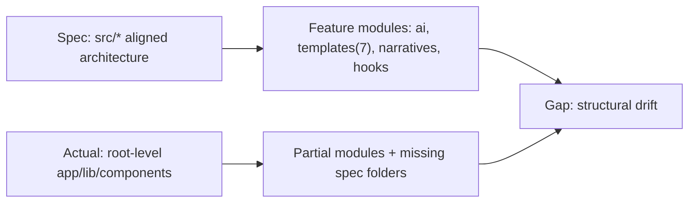
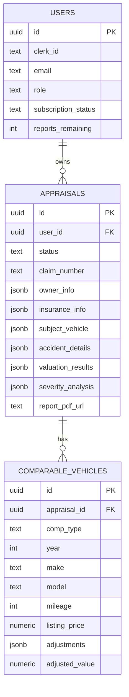
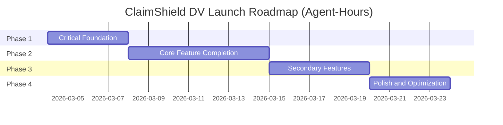

# ClaimShield DV Comprehensive Codebase Analysis & Launch Readiness Plan

Date: March 4, 2026  
Repository: `/Users/gsilkwood/Documents/CLAIMSHIELD DEV (MARCH EDITION)`  
Analysis Type: Zero-tolerance spec-vs-implementation audit

## Scope, Sources, and Method

### Specification sources used
1. `.agent/# ClaimShield DV - Master Appraisal Schema & Auto-Generation Logic .txt`
2. `.kiro/specs/claimshield-dv-platform/claimshield_greenfield.md`
3. `.kiro/specs/claimshield-dv-platform/requirements.md`

### Evidence collection performed
- Enumerated all non-generated repository files (`151` total; `127` in app/lib/components/hooks/tests/scripts scope).
- Reviewed all API routes under `app/api/**/route.ts`.
- Reviewed wizard flow and dashboard UX files under `app/(dashboard)` and `app/_components/wizard`.
- Reviewed calculation, legal, AI, payment, PDF, storage, and auth libraries under `lib/**`.
- Reviewed test suite under `tests/**`.
- Ran tooling checks (`npm audit`, timed `lint/build/test`, type check attempt, runtime smoke).
- Ran browser-agent smoke test (Playwright) against local dev server.

### Constraints encountered
- `npm run build`, `npm run lint`, and `npm run test:run` do not complete to clean pass state in this environment.
- Browser-agent smoke run showed root route failing with internal server error due dependency/runtime issues (details below).

---

## Phase 1: Deep Structural Audit (CRITICAL)

## 1.1 Project Architecture Validation

### File tree compliance (spec vs actual)

Spec in greenfield requires `src/`-rooted structure and specific modules (`claimshield_greenfield.md:329-442`).

Observed:
- App uses root-level `app/`, `lib/`, `components/` instead of `src/`.
- Core expected folders missing or not aligned:
  - Missing: `lib/narratives/*`, `lib/severity/*` split, `types/*`, `hooks/useWizardState.ts`, `hooks/useAppraisal.ts`.
  - Expected `api/ai/*` routes are not present in spec form; AI extraction is consolidated into `app/api/documents/extract/route.ts`.
  - Template set is incomplete (only 2 demand-letter templates exist vs 7 expected in spec).

Conclusion: **Partial structural compliance (~58%)** with significant divergence in module boundaries.

### Dependency audit

#### Installed dependency health
- `npm audit --json` reports **4 moderate vulnerabilities** (dev toolchain path: `drizzle-kit` -> `@esbuild-kit/*` -> `esbuild`).
- No prod vulnerabilities with `--omit=dev`.

#### Runtime/dependency compatibility blockers
Local run (`npm run dev -- --port 3005`) produced major compatibility failures:
- Clerk internal import/export mismatches (multiple `@clerk/backend/internal` export errors).
- React version mismatch at runtime (`react` unresolved vs `react-dom 19.2.4`).
- Root route renders internal server error in browser smoke test.

This is a **P0 launch blocker** because app cannot reliably boot.

#### Dependency usage gaps
- `app/api/appraisals/bulk-download/route.ts` imports `jszip`, but `jszip` is not declared in `package.json`.
- `vitest.config.ts` imports `loadEnv` from `vite`; `vite` exists as transitive package, but not declared direct dependency (fragile toolchain assumption).

### Configuration files

Status summary:
- `.env.local.example`: present and comprehensive.
- `lib/env.ts`: required env var validation present.
- `drizzle.config.ts`: configured but outputs to `./drizzle`.
- `drizzle/` directory: **missing** (no generated migrations found).
- `next.config.js`: minimal empty config.
- Firebase/GCP service config: not present (spec references GCP/Firebase architecture path).

Result: **Config completeness 70%**; migration artifact gap is critical for schema reproducibility.

---

## 1.2 Database Schema & Data Integrity

### Schema validation against master schema + requirements

Implemented DB tables:
- `users`
- `appraisals`
- `comparable_vehicles`

Strengths:
- Core table set exists.
- UUID PKs, JSONB payloads, and FK cascades are implemented.

Critical gaps:
- Indexes expected by requirements and migration docs are not declared in `lib/db/schema.ts`.
- Schema fields diverge from spec contracts in multiple places:
  - Missing expected user fields from greenfield (`fullName`, `onboardingComplete`, `reportsAvailable` naming mismatch).
  - Appraisal status enum differs from spec expectation (`calculating` missing).
  - `comparable_vehicles.accidentHistory` modeled as boolean vs spec text enum (`no_accidents`/`accident_reported`).

### Migration status
- `drizzle.config.ts` expects migration output in `./drizzle`, but directory does not exist.
- No checked-in migration history found.

Status: **Migration readiness: Broken**.

### Data seeding
- No seed scripts found in `scripts/` or dedicated seed module.

Status: **Missing**.

---

## 1.3 API & Integration Verification

### External integrations

#### Gemini AI
- Spec requires Gemini 3.1 Pro (`requirements.md:83`, greenfield Phase 3).
- Implementation uses `gemini-1.5-pro` in `lib/ai/gemini.ts`.

Status: **Partial/Misaligned**.

#### Apify
- `lib/scraping/apify-search.ts` uses placeholder actor id `'your-actor-id'`.

Status: **Broken (non-functional in production)**.

#### Stripe
- Webhook signature verification uses Stripe SDK correctly.
- However business logic is incomplete (TODOs for report-generation/email on successful payment).
- Pricing and plan model mismatch against requirements:
  - Spec: `$129` individual report + role plans (`requirements.md:318-321`, greenfield pricing table).
  - Code: `$99` report in `app/api/checkout/appraisal/route.ts` and `pro/enterprise` plans in `app/api/checkout/route.ts`.

Status: **Partial with monetization mismatch (P0)**.

### Internal API endpoint status

Implemented endpoint count: 23 routes.

High-risk issues found:
- Ownership authorization gaps:
  - `app/api/comparables/[id]/route.ts` (PATCH/DELETE by comp id without ownership guard).
  - `app/api/comparables/search/route.ts` inserts rows for arbitrary `appraisalId` without ownership check.
  - `app/api/documents/upload/route.ts` trusts client `appraisalId` without ownership validation.
  - `app/api/documents/[id]/route.ts` deletes blob URL from request body without checking appraisal ownership linkage.
- Mass assignment patterns:
  - `app/api/appraisals/[id]/route.ts` and `/auto-save/route.ts` call `.set({...body})` with untrusted payload.
- Share link security:
  - `app/api/appraisals/[id]/share/route.ts` creates base64 JSON token, unsigned/forgable, no server verification route present.
- Stubs/TODO routes:
  - `app/api/team/route.ts`
  - `app/api/templates/expert-affidavit/route.ts`
  - `app/api/webhooks/stripe/route.ts` (post-payment actions not completed)

API status: **Partial (~52%) with multiple P0/P1 defects**.

---

## Phase 2: Feature Completeness Analysis (HIGH)

## 2.1 Core feature implementation status

| Feature | Status | Completeness | Key Blockers |
|---|---|---:|---|
| User authentication/authorization | Partial | 62% | Dev/runtime dependency break (Clerk/React), onboarding role update misuse, ownership gaps on some routes |
| Appraisal creation wizard | Partial | 55% | Route path bugs (`/appraisals/...` vs `/dashboard/appraisals/...`), several steps not wired to state, autosave state mismatch |
| AI document extraction | Partial | 47% | Wrong Gemini model, Step4 request schema mismatch (`documentId` vs API expects URL/type), image analysis path incomplete |
| Comparable search | Partial | 50% | Placeholder Apify actor, no ownership check in search insert flow |
| DV calculation engine | Partial | 68% | Hardcoded pre-accident grade assumption, `dvPercentOfRepair` not computed, type safety gaps (`any`) |
| Severity classification | Complete-ish | 78% | Core logic implemented; still missing deeper extraction-driven signal integration |
| Legal citation generation | Partial | 72% | GA/NC/default coverage only, broader state handling absent |
| PDF report generation | Partial/Broken | 38% | Current PDF is minimal (single-page style output) vs required 15-25 page professional report |
| Report preview/download/share | Partial | 51% | Share token insecure, preview path mismatches in wizard, storage access model not private |
| Document templates | Partial | 35% | Only two demand letter templates implemented; expert affidavit route is TODO |
| Payment processing | Partial | 44% | Pricing mismatch, plan mismatch, webhook downstream actions TODO |
| Email delivery | Partial | 61% | Core send works, but trigger lifecycle incomplete |
| Dashboard & appraisal management | Partial | 63% | Core listing/actions exist; several pages are placeholders |
| Claims/document workflows | Partial | 49% | Document library/template pages “coming soon”, extraction plumbing mismatched |
| Mobile responsiveness | Partial | 64% | Basic responsive classes present, no full workflow validation |
| Accessibility | Partial | 46% | Some labels exist; no consistent keyboard/ARIA pass and alert-based UX remains |

### Requirements-level rollup (R1-R30)

- Complete/near-complete: R5, R7, R8, portions of R10, R16, R24.
- Partial: R1, R2, R3, R4, R6, R9, R11, R12, R14, R15, R18, R19, R20, R21, R22, R28, R29, R30.
- Mostly missing/broken: R13 (full template set), R17 (document library), R25/R26 (deep extraction + image comparison behaviors), R27 (educational resources).

Overall feature completion estimate: **56%**.

---

## 2.2 Nice-to-have and v2 features

Secondary features in spec and status:
- Expert witness affidavit generation: **Missing** (route stub).
- White-label body-shop features: **Missing**.
- Attorney team/paralegal management: **Partial UI, backend missing**.
- Educational resources and negotiation guidance center: **Missing**.
- Expanded legal state-specific guidance coverage: **Partial**.
- Advanced analytics/reporting: **Partial (dashboard basics only)**.

Estimated effort for secondary/v2 completion: **180-260 agent-hours**.

---

## Phase 3: Code Quality & Technical Debt (HIGH)

## 3.1 Code quality findings

### Security vulnerabilities

P0 findings:
1. Broken object-level authorization on comparables/documents endpoints.
2. Mass assignment on appraisal update/auto-save endpoints.
3. Public Blob storage and non-signed sharing model for sensitive report/doc URLs.
4. Forgable share token (base64 payload, unsigned).
5. No server-side rate limiting despite requirement.

P1 findings:
1. `validateWebhookSignature()` placeholder returns `true` in `lib/utils/security.ts`.
2. CSP includes `'unsafe-inline'` and `'unsafe-eval'`.
3. Client onboarding posts to webhook endpoint directly (`/api/webhooks/clerk`) as role update channel.

### Performance and reliability issues

- Missing DB indexes for high-frequency filters/joins.
- Bulk download fetch loop is serial and can be slow at scale.
- Build/test/lint not reliably runnable to completion in current environment.
- Wizard autosave uses isolated state not clearly synchronized with step components.

### Maintainability issues

- Multiple TODO/stub endpoints shipped in core paths.
- Inconsistent route conventions (`/dashboard/appraisals` vs `/appraisals`).
- Significant `any` usage in critical calculation/API paths.
- Test suite contains mismatched contracts and mock-only logic not validating production code.

---

## 3.2 Technical debt classification

### P0 Launch blockers

| ID | Issue | Files | Root Cause | Fix Approach | Est. Agent-hours |
|---|---|---|---|---|---:|
| P0-01 | App boot/runtime dependency incompatibility (Clerk/React) | `package.json`, lockfile, runtime | Version skew / incompatible transitive set | Re-resolve lockfile, align Clerk+React matrix, verify with clean install and smoke build | 10 |
| P0-02 | Broken object authorization on comparables/documents | `app/api/comparables/*`, `app/api/documents/*` | Missing ownership checks | Add appraisal ownership join checks to all mutating and write routes | 14 |
| P0-03 | Mass assignment in appraisal update endpoints | `app/api/appraisals/[id]/route.ts`, `.../auto-save/route.ts` | Unvalidated spread assignment | Introduce strict Zod schemas + allowlist field mapping | 10 |
| P0-04 | Monetization mismatch ($99 vs $129; wrong plans) | checkout routes + payment lib | Drift from requirements | Normalize plan model and Stripe price mapping to spec | 8 |
| P0-05 | Public storage for sensitive docs/reports | `lib/storage/blob.ts` + document/report routes | Security model not enforced | Switch to private blob + signed URL issuance and revocation policy | 10 |
| P0-06 | Report generation scope far below required 15-25 page output | `lib/pdf/generator.tsx` | Placeholder implementation | Implement full sectioned report assembler + multi-page document output | 42 |
| P0-07 | Missing migration history and indexes | `lib/db/schema.ts`, `drizzle.config.ts` | Incomplete schema ops discipline | Add indexes, generate migrations, verify in Neon | 12 |

### P1 Revenue/scale risks

| ID | Issue | Files | Fix Approach | Est. Agent-hours |
|---|---|---|---|---:|
| P1-01 | Apify actor placeholder | `lib/scraping/apify-search.ts` | Replace with production actor and robust mapping/retries | 8 |
| P1-02 | Gemini model mismatch | `lib/ai/gemini.ts` | Update to required model and prompt contracts | 4 |
| P1-03 | Stripe webhook post-payment TODOs | `app/api/webhooks/stripe/route.ts` | Implement idempotent fulfillment + email/report trigger | 12 |
| P1-04 | Document extraction request contract mismatch | `Step4DocumentUpload.tsx`, `documents/extract route` | Align payload schema and processing pipeline | 8 |
| P1-05 | Wizard navigation path inconsistencies | wizard layout/steps | Centralized route helpers and integration tests | 6 |
| P1-06 | Team/expert affidavit endpoints are stubs | `app/api/team/route.ts`, `app/api/templates/expert-affidavit/route.ts` | Complete feature implementation per role | 24 |

### P2 Optimize later

| ID | Issue | Files | Fix Approach | Est. Agent-hours |
|---|---|---|---|---:|
| P2-01 | Alert-based UX and accessibility debt | `FileUpload.tsx`, `AppraiserFields.tsx`, others | Replace with accessible toast/inline errors | 8 |
| P2-02 | Test suite contract drift | `tests/**` | Rewrite to current API contracts and stable fixtures | 20 |
| P2-03 | Performance tuning and caching layer | dashboard, API reads | Add caching, pagination, query optimization | 18 |

---

## 3.3 Testing coverage and gaps

### Current status
- Test files exist for auth, validation, calculations, legal, templates, DB cascade.
- Reliable pass/fail confidence is low due:
  - contract mismatch in auth tests (`requireAuth(auth)` signature mismatch),
  - mock-only template tests not linked to production template engine,
  - heavy DB assumptions without deterministic fixture lifecycle.

### Coverage estimate
- Effective trustworthy coverage estimate: **~30-40% of critical workflows**.

### Missing critical tests
- API authorization tests for each mutating endpoint.
- End-to-end wizard happy path and failure path tests.
- Payment webhook fulfillment idempotency tests.
- File upload + extraction + merge workflow tests.
- PDF structural verification (section count, legal text presence).

### Browser automation requirements (Antigravity/Playwright)
- Login and onboarding role selection.
- New appraisal complete flow (steps 1-8).
- Upload + extraction workflow.
- Comparable search + include/exclude toggles.
- Calculation + report generation + purchase + email.
- Mobile viewport pass (320px, 768px, 1024px, desktop).

---

## Phase 4: AI Agent Readiness Assessment (CRITICAL)

## 4.1 Codebase analyzability

Strengths:
- Reasonable module separation (`app`, `lib`, `components`).
- Rich specification docs available in-repo.

Weaknesses:
- Spec/code divergence is high in critical monetization and workflow areas.
- Multiple TODO/stub endpoints produce ambiguous ownership for agents.
- Routing inconsistencies and state wiring gaps in wizard reduce deterministic agent execution.
- Toolchain instability blocks autonomous confidence gates.

Agent readiness score: **54/100**.

## 4.2 Automation opportunities

High-value automation targets:
1. API contract conformance tests from OpenAPI/Zod schemas.
2. Browser workflow checks for wizard, checkout, and template generation.
3. Visual regression on report preview and dashboard cards.
4. PDF post-generation validation (page count, section anchors, legal sections).
5. Security regression suite (authz matrix tests across all endpoints).

---

## Phase 5: Comprehensive Launch Roadmap

## 5.1 Phased development plan (24/7 autonomous model)

### Phase 1 - Critical Foundation
Estimated effort: **96 agent-hours**
- Resolve all P0 boot/security/schema blockers.
- Stabilize runtime and migrations.
- Fix authz and mass-assignment patterns.

### Phase 2 - Core Feature Completion
Estimated effort: **212 agent-hours**
- Complete primary workflows to 100% spec alignment.
- Finish payment/report pipeline and required templates.
- Implement complete wizard/data flow correctness.

### Phase 3 - Secondary Feature Implementation
Estimated effort: **148 agent-hours**
- Team management, expert affidavit, educational resources, expanded legal/state coverage.
- Advanced reporting and UX enhancements.

### Phase 4 - Polish & Optimization
Estimated effort: **104 agent-hours**
- Performance hardening, full automated test matrix, accessibility compliance, docs hardening.

Total estimated effort: **560 agent-hours**.

At 24/7 parallel execution with 5 tracks and ~65% effective concurrency, this is feasible in roughly **7-14 calendar days** depending on human review latency and external service setup.

## 5.2 Parallel workstream mapping

- Track 1 Frontend Components: wizard state wiring, route consistency, template/document pages, accessibility fixes.
- Track 2 Backend API: authz hardening, schema validation, webhook/idempotency, template APIs.
- Track 3 Database/Data Layer: schema deltas, indexes, migrations, seed fixtures.
- Track 4 Integration/Testing: Stripe/Apify/Gemini integration tests, E2E automation, contract tests.
- Track 5 Documentation/DevOps: runbooks, environment checkers, CI pipeline + quality gates.

---

## Phase 6: Executive Summary & Recommendations

## 6.1 Current state assessment

- Estimated overall completion: **56%**.
- Most critical gaps:
  1. Runtime dependency compatibility prevents stable app boot.
  2. Security authorization gaps in core mutating APIs.
  3. Monetization drift from pricing/plan specs.
  4. Report generation depth far below launch requirement.
  5. Missing migration/index discipline.

- Biggest launch risks:
  - Security breach or unauthorized data mutation.
  - Revenue leakage from incorrect pricing and entitlement handling.
  - Inability to ship legally-defensible report quality at required structure.

## 6.2 Launch readiness score

**Launch Readiness Score: 43/100**

Justification:
- Core concept and several primitives are in place.
- However, critical security, monetization, and production reliability controls are not launch-safe yet.

## 6.3 Estimated time to launch (24/7 agent model)

- Aggressive (optimal): **7-9 calendar days**.
- Conservative (with review/rollback buffers): **12-16 calendar days**.

## 6.4 Top 5 immediate priorities (start today)

1. Fix dependency/runtime break (Clerk/React alignment) and enforce clean `dev/build/test` baseline.
2. Patch all API authorization and mass-assignment vulnerabilities.
3. Correct Stripe pricing/plan model and webhook fulfillment flow.
4. Implement private blob + signed URL strategy for documents/reports.
5. Establish schema indexes + migration history and verify DB consistency.

## 6.5 Resource requirements

Agent types needed:
- Code Generation (backend/frontend/refactors)
- Database Specialist (schema/migrations/indexes)
- Browser Testing Agent (Playwright/E2E)
- Security Review Agent (authz/input/storage/csp)
- Documentation/DevOps Agent (CI gates/runbooks)

Human oversight checkpoints:
- Pricing/plan policy confirmation.
- Legal template and citation sign-off.
- Security sign-off before production deploy.
- Final go/no-go launch approval.

External services required:
- Clerk (stable version set)
- Stripe product/price IDs aligned to spec
- Gemini 3.1 Pro key/config
- Apify production actor
- SendGrid verified sender/domain
- Neon production database + backups

## 6.6 Risk assessment and mitigation

Top technical risks:
- Dependency lock/version drift causes unstable runtime.
- Authorization gaps expose cross-tenant data operations.
- Spec drift continues due missing contract tests.

Mitigations:
- Pin dependency matrix and lockfile policy.
- Add mandatory API contract + authz tests in CI.
- Introduce spec traceability checklist per PR (Req ID mapping).
- Block merges without security + integration gate pass.

---

## Visual Artifacts

## A. Expected vs Actual Structure (high-level)

## B. Database schema (current implementation)

## C. Phase timeline (agent-hour plan)

---

## Evidence Highlights (line-referenced)

- Pricing mismatch: `$99` unit amount in `app/api/checkout/appraisal/route.ts`.
- Plan mismatch (`pro/enterprise`) in `app/api/checkout/route.ts`.
- Public blob access and stub signed URL in `lib/storage/blob.ts`.
- Gemini model mismatch in `lib/ai/gemini.ts`.
- Placeholder Apify actor in `lib/scraping/apify-search.ts`.
- Mass assignment in appraisal update and autosave routes.
- Missing ownership checks in comparables/documents routes.
- Stub team and expert affidavit routes.
- Wizard route/path bugs in `WizardLayout`, `Step7Review`, `Step8Generate`.
- Template/document pages marked “coming soon”.
- Migration/index mismatch (`drizzle.config.ts` points to missing `drizzle/`; schema has no index declarations).

---

## Appendix A: Requirement-by-Requirement Status Matrix (R1-R30)

| Req | Requirement | Status | % | Primary Blockers | Upstream Dependencies |
|---|---|---|---:|---|---|
| R1 | Authentication and authorization | Partial | 62 | Runtime dependency break, inconsistent role update path | CS-LR-001, CS-LR-014 |
| R2 | Appraisal wizard flow | Partial | 55 | Broken routing/state wiring | CS-LR-015, CS-LR-016 |
| R3 | AI document analysis | Partial | 47 | Gemini model mismatch, payload contract mismatch | CS-LR-017, CS-LR-018 |
| R4 | File upload and storage | Partial | 52 | Public storage model, missing ownership checks | CS-LR-004, CS-LR-006 |
| R5 | VIN decoding and vehicle info | Partial | 60 | VIN decode behavior mostly placeholder in step UI | CS-LR-016 |
| R6 | Comparable search | Partial | 50 | Apify placeholder actor, missing ownership guard | CS-LR-003, CS-LR-019 |
| R7 | Valuation calculations | Partial | 68 | Incomplete formula outputs (`dvPercentOfRepair`) | CS-LR-020 |
| R8 | Damage severity classification | Partial | 78 | Needs deeper integration with extraction results | CS-LR-017, CS-LR-020 |
| R9 | Narrative generation | Partial | 52 | Narrative sections not fully integrated in report pipeline | CS-LR-021 |
| R10 | State-specific legal citations | Partial | 72 | Limited state coverage beyond GA/NC/default | CS-LR-028 |
| R11 | PDF report generation | Partial/Broken | 38 | Current PDF far short of required structure | CS-LR-021 |
| R12 | Report preview/download | Partial | 51 | Access model and routing/security inconsistencies | CS-LR-022 |
| R13 | Document templates | Partial | 35 | Only 2/7 templates implemented | CS-LR-023, CS-LR-024 |
| R14 | Payment processing | Partial | 44 | Pricing/plan mismatch + webhook TODOs | CS-LR-008, CS-LR-009, CS-LR-010 |
| R15 | Email delivery | Partial | 61 | Trigger lifecycle incomplete | CS-LR-026 |
| R16 | Dashboard/appraisal management | Partial | 63 | Core exists; related pages incomplete | CS-LR-025 |
| R17 | Document library | Missing/Partial | 32 | Placeholder page state | CS-LR-025 |
| R18 | Role-based features | Partial | 58 | Gating exists but features incomplete | CS-LR-027, CS-LR-029 |
| R19 | Onboarding and role selection | Partial | 52 | Incorrect role update path | CS-LR-014 |
| R20 | State law warning banners | Partial | 70 | Implemented baseline only, no deep contextual handling | CS-LR-028 |
| R21 | Validation/error handling | Partial | 57 | Inconsistent API and UI error handling | CS-LR-005, CS-LR-031 |
| R22 | Performance requirements | Partial | 43 | No proven SLA compliance, missing indexes/caching | CS-LR-011, CS-LR-034 |
| R23 | Security requirements | Partial | 41 | Authz, storage, rate limiting gaps | CS-LR-003, CS-LR-004, CS-LR-005, CS-LR-006, CS-LR-035 |
| R24 | DB schema/persistence | Partial | 66 | Missing indexes/migrations and some model drift | CS-LR-011, CS-LR-012 |
| R25 | Repair estimate line-item extraction | Partial | 46 | Extraction depth/field mapping incomplete | CS-LR-017, CS-LR-018 |
| R26 | Before/after image analysis | Partial | 40 | Limited implementation and merge workflow gaps | CS-LR-017, CS-LR-018 |
| R27 | Educational resources | Missing | 15 | Module not implemented | CS-LR-028 |
| R28 | Responsive/mobile support | Partial | 64 | Needs systematic viewport QA and fixes | CS-LR-030 |
| R29 | Accessibility compliance | Partial | 46 | ARIA/keyboard/alerts and semantic gaps | CS-LR-031 |
| R30 | Environment configuration | Partial | 74 | Env validation exists; runtime compatibility still blocking | CS-LR-001, CS-LR-002 |

## Appendix B: Secondary/Nice-to-Have and V2 Feature Effort

| Feature | Current Status | Est. Agent-Hours | Notes |
|---|---|---:|---|
| Expert witness affidavit workflow | Missing/Stub | 16 | API and template implementation required |
| Attorney team management with invites | Partial UI only | 24 | Needs backend model + invitation flow |
| Body shop white-label customization | Missing | 14 | Role-gated settings and template branding |
| Educational resource center | Missing | 18 | Topic taxonomy + content rendering |
| Expanded state law knowledge base | Partial | 10 | Additional state legal summaries and citation rules |
| Negotiation script generation | Missing | 8 | Template/content pack and UX integration |
| Advanced analytics dashboard widgets | Partial | 12 | KPI aggregation and performance metrics |
| Visual regression suite for critical pages | Missing | 10 | Browser automation baseline snapshots |
| PDF section validation harness | Missing | 8 | Automated structural checks post generation |

Total secondary effort estimate: **120 agent-hours** (core subset) to **180+ agent-hours** (full V2 breadth).

## Appendix C: Key Evidence Index (File:Line)

- `app/api/comparables/[id]/route.ts:16-20,41-44` (update/delete without ownership validation)
- `app/api/comparables/search/route.ts:10-11,24-29` (accepts arbitrary appraisalId)
- `app/api/documents/upload/route.ts:11-13,28-33` (trusts client appraisalId/fileType)
- `app/api/documents/[id]/route.ts:12-16` (deletes arbitrary blob URL)
- `app/api/appraisals/[id]/route.ts:42-49` (mass assignment)
- `app/api/appraisals/[id]/auto-save/route.ts:16-23` (mass assignment)
- `app/api/appraisals/[id]/share/route.ts:40-47` (unsigned base64 token)
- `app/api/checkout/appraisal/route.ts:64` (unit_amount = 9900)
- `app/api/checkout/route.ts:11-14` (pro/enterprise plans only)
- `app/api/webhooks/stripe/route.ts:50-51,142` (TODO fulfillment paths)
- `app/api/team/route.ts:18-20,68-73` (team API stubs)
- `app/api/templates/expert-affidavit/route.ts:25-31` (expert affidavit stub)
- `lib/storage/blob.ts:19-24,31-34` (public access + stub signed URL)
- `lib/ai/gemini.ts:11` (model set to gemini-1.5-pro)
- `lib/scraping/apify-search.ts:49-52` (placeholder actor id)
- `lib/pdf/generator.tsx:108-157` (single page report implementation)
- `app/_components/wizard/WizardLayout.tsx:45,49` (wrong route namespace)
- `app/_components/wizard/Step7Review.tsx:75` (uses VIN in route id slot)
- `app/_components/wizard/Step8Generate.tsx:47` (wrong preview route namespace)
- `app/(auth)/onboarding/page.tsx:48-55` (posts role changes to webhook endpoint)
- `drizzle.config.ts:5` with missing `drizzle/` directory (migration output path gap)
- `lib/db/schema.ts` (no index declarations despite docs requiring indexes)
- `app/(dashboard)/appraisals/[id]/documents/page.tsx:41` (coming soon placeholder)
- `app/(dashboard)/appraisals/[id]/templates/page.tsx:25` (coming soon placeholder)

